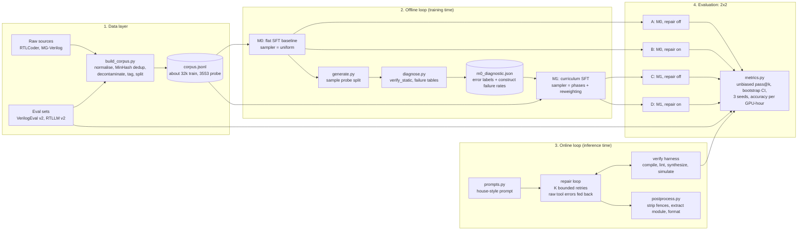
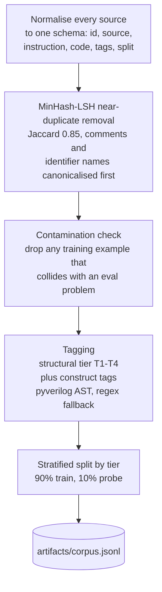
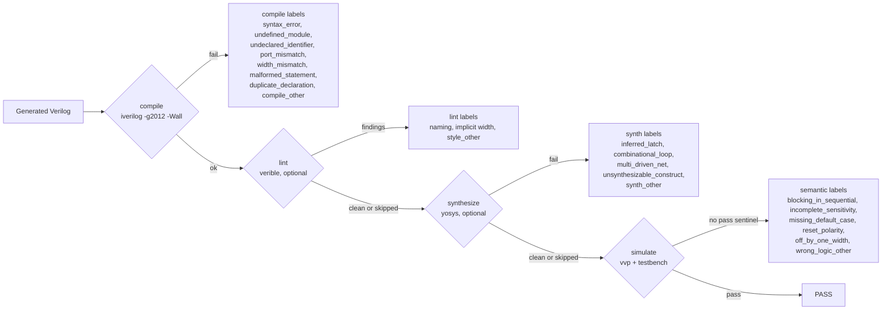
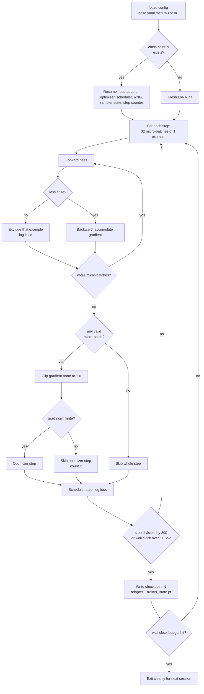
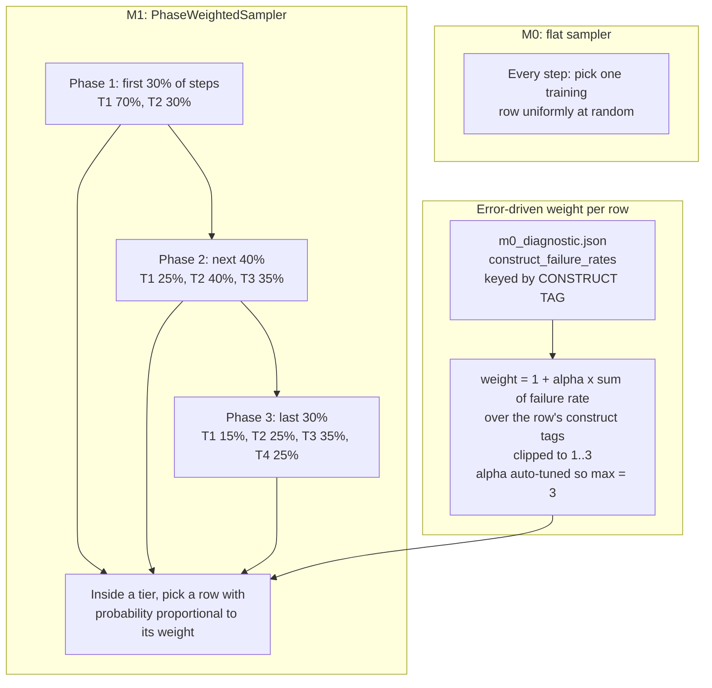
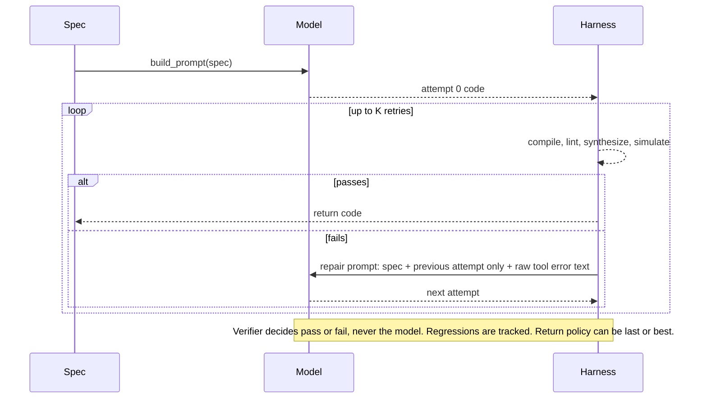
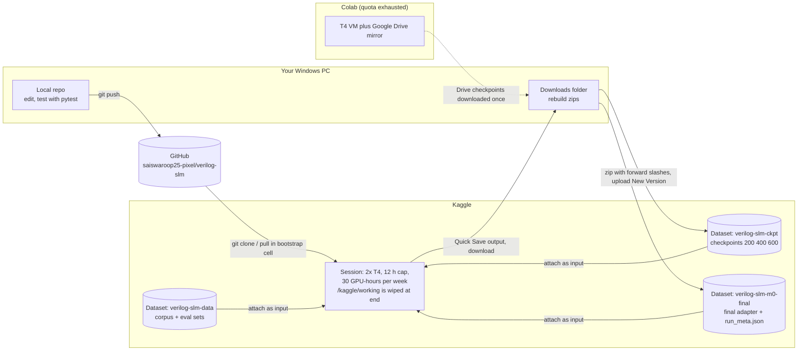
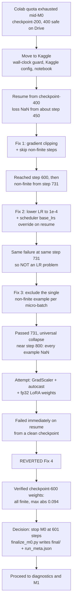

# Verilog SLM: the whole project, explained

This document explains everything in the project and everything we did in the
recent working sessions, in plain language. Diagrams are written in Mermaid,
so they render automatically on GitHub and in VS Code (Markdown Preview
Mermaid extension). Figure captions follow paper style so you can lift them
into your report.

Contents

1. The project in one page
2. Glossary (plain-language)
3. Architecture figures
4. Component walkthrough
5. What we did, in order (Kaggle move, the NaN saga, diagnostics, the bug fix)
6. Current state and numbers
7. Open issues and risks (read this before trusting M0/M1 results)
8. What to do next
9. Suggested limitations text for the dissertation
10. File map and commit log

---

## 1. The project in one page

**Goal.** Make a small language model (1.5 billion parameters) write good
Verilog (hardware description code), where "good" means it compiles, can be
synthesized into real hardware, follows house style, and passes a testbench.

**Core idea.** Two feedback loops, both closed by real tools (a compiler,
linter, synthesizer, simulator) instead of the model grading itself:

- **Offline loop (training time).** Train a baseline model **M0** with plain
  fine-tuning. Measure *what it gets wrong*. Use those failures to build a
  smarter training schedule (a *curriculum*) and train **M1** with the same
  budget. If M1 beats M0, the curriculum helped.
- **Online loop (inference time).** When the model writes broken code, feed
  the compiler's error message back to it and let it retry a bounded number
  of times (*repair loop*).

**The experiment.** A 2x2 table: {M0, M1} x {repair off, repair on}. This
separates the effect of the curriculum from the effect of repair.

**Rule that keeps the experiment honest.** M0 and M1 must differ in
*exactly one thing*: how training examples are sampled. Same base model,
same learning rate, same number of steps, same seed.

**Where we are.** M0 is trained but stopped early (601 of a planned 2997
steps) because of numerical instability on the T4 GPUs. We moved from Colab
to Kaggle when Colab's GPU quota ran out. We built the diagnostic pass,
found and fixed a silent bug that made M1's error-driven reweighting do
nothing, and were about to start M1.

---

## 2. Glossary

| Term | Plain meaning |
|---|---|
| **SFT** | Supervised fine-tuning: show the model (instruction, correct code) pairs and nudge it to reproduce them. |
| **LoRA** | Instead of changing all 1.5B weights, train small add-on matrices (adapters). Cheap and small to save (about 141 MB). |
| **QLoRA** | LoRA on top of a base model stored in 4-bit numbers to save memory. |
| **fp16 / bf16** | 16-bit number formats. fp16 has a narrow range and overflows easily. The T4 GPU can only do fp16 well, not bf16. |
| **NaN** | "Not a number". Once a NaN enters a calculation it spreads to everything after it. |
| **Gradient clipping** | Cap how big a single update can be so one bad batch cannot wreck the weights. |
| **Checkpoint** | A saved snapshot (adapter weights + optimizer state + step counter) so training can resume. |
| **Curriculum** | Ordering/weighting training examples on purpose (easy first, oversample what the model fails at). |
| **Tier (T1..T4)** | Structural difficulty of a design: T1 combinational, T2 sequential, T3 finite-state machine, T4 multi-module. |
| **Construct tag** | Which Verilog features a design uses, e.g. `case_stmt`, `async_reset`, `generate_block`. |
| **Error label** | Why a generated design failed, e.g. `syntax_error`, `inferred_latch`. Not the same thing as a construct tag. |
| **Probe split** | A 10% slice of the corpus held out from training, used to *diagnose* M0 (never trained on). |
| **pass@k** | Probability that at least one of k samples is correct. The unbiased estimator is used. |
| **Ablation** | Change one thing, keep everything else fixed, measure the difference. |
| **Kaggle Dataset** | Persistent storage on Kaggle. The session disk is wiped when a session ends; a Dataset is not. |

---

## 3. Architecture figures

### Figure 1. End-to-end system architecture

*Fig. 1. Four layers. The data layer builds one tagged corpus. The offline loop trains M0, measures its failures on a held-out probe split, and feeds that table into M1's sampler. The online loop wraps any model in a verifier-gated repair loop. The evaluation layer crosses the two models with repair on/off.*

### Figure 2. Data pipeline

*Fig. 2. Corpus construction. Step 3 protects the benchmark from leakage; every drop is counted and reportable.*

### Figure 3. Four-stage verification harness and error taxonomy

*Fig. 3. Every failure anywhere in the project is reduced to exactly one label from a frozen enum (`src/verify/taxonomy.py`). The diagnostic pass on the probe split has no testbenches, so it uses `verify_static()` (first three stages only).*

### Figure 4. Training loop internals (`src/train/sft.py`)

*Fig. 4. Effective batch = 1 example x 32 accumulation = 32. Gradients from the 32 micro-batches are summed before one optimizer step. The three guards (non-finite loss exclusion, gradient clipping, non-finite grad-norm skip) and the wall-clock exit were all added during the NaN saga (Section 5).*

### Figure 5. Curriculum sampler (M1) versus flat sampler (M0)

*Fig. 5. M0 and M1 run for the same number of steps; only which examples fill the steps differs. The fix in Section 5.6 corrected the key used in the "Error-driven weight" box (construct tag, not error label).*

### Figure 6. Online repair loop

*Fig. 6. Design points: raw error text (not summarised), only the previous attempt in context, K is a hard bound, regressions logged.*

### Figure 7. Compute and persistence architecture (how work moved from Colab to Kaggle)

*Fig. 7. Code travels through GitHub; data and checkpoints travel through Kaggle Datasets. Nothing on the session disk survives the session, so every artifact worth keeping must round-trip through a Dataset.*

### Figure 8. The instability debugging timeline (decision tree)

*Fig. 8. Each "Fix" addressed a real defect found by evidence, but none removed the underlying fp16 instability. Fix 4 made things worse and was reverted on evidence. The run was finalized at the last verified-clean checkpoint.*

### Figure 9. Roadmap and status

*Fig. 9. Status at the time of writing.*

---

## 4. Component walkthrough

### 4.1 Data (`src/data/`)
`build_corpus.py` merges the two training sources into one schema, removes
near-duplicates with MinHash, and removes anything that collides with the two
benchmark sets, so the model is never trained on the test questions.
`tagger.py` labels every example with a tier and construct tags (using an AST
parser when it can, regexes otherwise). `splits.py` holds out 10% as the
probe split, stratified by tier. Results are stored in
`artifacts/corpus.jsonl` (not in git; it is built once and stored in a Kaggle
Dataset).

### 4.2 Prompts (`src/utils/prompts.py`)
One file holds the system prompt (the "house style contract": nonblocking
assignments in clocked blocks, explicit `default` in `case`, no latches, and
so on), the generation template, and the repair template. Training text and
inference prompts are built from the same template so they cannot drift apart.

### 4.3 Verification (`src/verify/`)
`harness.py` runs the four stages of Figure 3 and returns one
`VerifyResult`. `classify.py` turns raw tool text into one label from the
frozen enum in `taxonomy.py`. The lint and synthesis stages are this
project's addition to the base guide, because a passing testbench does not
prove the design is synthesizable or reviewable (see
`docs/industry_standards.md`).

### 4.4 Training (`src/train/`)
`sft.py` is the single training entry point. It loads the base model in 4-bit,
attaches LoRA adapters, and runs the loop in Figure 4. Config files layer:
`base.yaml` holds the shared settings, `m0_*.yaml` and `m1_*.yaml` add only
what differs. `curriculum.py` holds the phase-based sampler and the
reweighting function (Figure 5).

Key settings: Qwen2.5-Coder-1.5B-Instruct, 4-bit NF4, LoRA r=32 alpha=64
dropout 0.05 on all attention and MLP projections, sequence length 2048,
batch 1 x 32 accumulation, cosine schedule with 3% warmup, seed 1337.

### 4.5 Inference and repair (`src/infer/`)
`generate.py` does batched sampling from a trained adapter. `repair.py` is the
bounded loop of Figure 6. `postprocess.py` strips markdown fences, keeps only
the module, and formats with verible.

### 4.6 Evaluation (`src/eval/`)
`diagnose.py` builds the failure tables from probe-split generations.
`metrics.py` holds pass@k (unbiased), bootstrap confidence intervals, error
rate tables, and accuracy per GPU-hour. `run_eval.py` runs the 2x2.

### 4.7 Tests (`tests/`)
51 pure-Python tests pass (3 skipped). None of them need a GPU or iverilog.
Note: `sft.py` itself has no unit tests because it needs the GPU stack.

---

## 5. What we did, in order

### 5.1 Starting state
The repo was clean on `master`. M0 was mid-run on Colab: memory checks had
passed (batch 1, sequence 2048), a batch-2 test was slower, resumable
checkpoints mirrored to Google Drive existed, and stdout buffering through
`tee` had been fixed.

### 5.2 Moving from Colab to Kaggle
**Problem.** Colab's GPU quota ran out. Kaggle offers about 30 GPU-hours per
week with a hard 12-hour cap per session (verified by web search, not
assumed).

**Design.** `sft.py`'s resume logic already keyed off local `checkpoint-N/`
folders, so it was platform-independent. Kaggle *kills* a session at the cap
(Colab only disconnects), which could truncate a checkpoint mid-write. So we:

- added `training.max_wall_hours`: check every step; save a clean checkpoint
  and exit before the platform kills the process;
- added `configs/m0_baseline_kaggle.yaml` (same `run_name: m0`, so it resumes
  the same run; adds `max_wall_hours: 11.5`);
- built `notebooks/02_train_kaggle.ipynb` with a Kaggle-native bootstrap.

**Things that went wrong along the way, and why**

| Symptom | Cause | Fix |
|---|---|---|
| `Could not resolve host: github.com` | Kaggle Internet toggle was off | Turn Internet on, restart session |
| `configs/m0_baseline_kaggle.yaml` not found | New files existed only locally, never pushed | Commit and push (rebased over Colab's auto-commit) |
| Restored corpus/checkpoint not found | Kaggle mounts Datasets at different paths in different sessions (`/kaggle/input/<slug>/` vs `/kaggle/input/datasets/<user>/<slug>/`) | Bootstrap searches all of `/kaggle/input` recursively by filename |
| `adapter_config.json` missing inside restored checkpoint | Uploaded zip landed double-nested (`checkpoint-400/checkpoint-400/...`) | Match by `adapter_config.json` presence; manual `cp` from the real path when needed |
| Silent skip of restore | "skip if destination exists" printed nothing | Print an explicit `skipped` message |
| Kaggle rejected our zip: `forbidden character '\'` | PowerShell 5.1 `Compress-Archive` writes backslash paths | Build zips with .NET `ZipArchive` and forward slashes |
| `trainer_state.pt` arrived as `trainer_state.zip` | `.pt` files are already ZIP containers; Kaggle relabelled it | Rename back; verified by loading with `torch.load` |
| Files "vanished" from a Downloads folder | Unclear (Defender history showed nothing relevant) | Re-download and re-verify |
| `ConcurrencyViolation` on Save Version | Notebook draft advanced by another tab | Close extra tabs, refresh, or download manually |

**Throughput check.** On 2x T4 with `device_map="auto"` the model is split
across both GPUs (pipeline style, not data-parallel). Measured: batch 1 about
42.3 s/step, batch 2 about 57.6 s/step. So the split does not help; we kept
batch 1. Full 601 steps is about 7 GPU-hours.

### 5.3 The NaN saga (why M0 stopped at 601 steps)

The loss became NaN from about step 450. NaN in the forward pass poisons
every later computation, so a run that hits it never recovers by itself.

1. **Fix 1: gradient clipping and skipping non-finite steps.** Cap the update
   size; if the gradient norm is already NaN or infinite, skip the update.
   Result: run reached step 600, then failed again around step 731.
2. **Fix 2: lower the learning rate to 1e-4.** This needed a code change:
   when a checkpoint is loaded the scheduler restores its old base learning
   rate and silently overwrites the new config value. We now force the
   scheduler's base LR from the current config after loading. Result: same
   failure at the same step 731. Same step under a different LR means the cause
   was **not** the learning rate.
3. **Fix 3: per-example exclusion.** Reasoning: each optimizer step sums
   gradients from 32 examples; the sampler's random state is restored on
   resume, so the same 32 examples appear at step 731 every time. One example
   with a NaN loss poisons the whole sum. We now check each example's loss and
   exclude only that example. Result: training passed 731 and reached about
   800, then **every** example gave NaN (a universal collapse).
4. **Fix 4 (reverted): GradScaler + autocast + fp32 LoRA weights.** The
   standard mixed-precision recipe. On resuming from a checkpoint whose
   weights we had verified finite and small (max absolute value 0.094), it
   failed immediately on the first step, worse than before. Likely an
   interaction with the 4-bit base layers that we could not verify without a
   GPU to test on. Reverted on the evidence.
5. **Verification we ran.** Loaded `checkpoint-800` and `checkpoint-600`
   adapters and optimizer state and checked for NaN/inf: both clean. So the
   files were fine; the numerical fragility appears when running the
   forward pass. Also found the logged moving-average loss was permanently
   NaN after one bad step (0.98 x NaN stays NaN forever); a cosmetic bug we
   fixed by resetting it on resume.
6. **Decision.** Stop M0 rather than keep spending GPU-hours. We wrote
   `scripts/finalize_m0.py`, which builds `artifacts/m0/final/` and
   `run_meta.json` in the same format `sft.py` writes on natural completion,
   with `total_steps: 601` and a `stopped_early_reason`. Everything
   downstream (M1's assertion, diagnostics, eval) then treats it as M0's
   finished run.

Honest status: the root cause of the fp16 instability was **not** found. The
guards contain it but do not remove it.

### 5.4 Persisting M0
We downloaded `final/` and `run_meta.json`, zipped them with correct paths,
and uploaded the Kaggle Dataset `verilog-slm-m0-final`.

### 5.5 Inference and diagnostic-pass fixes
Running the diagnostic pass exposed several separate problems:

| Problem | Cause | Fix |
|---|---|---|
| `tokenizer.json` JSON parse error at a fixed byte offset in every copy | The saved copy was corrupt at creation (size matched, content did not) | Load the tokenizer from the base model; LoRA never changes it |
| `incompatible torchao` ImportError | Kaggle's torchao is older than what peft requires | `pip install -U torchao` |
| "right-padding detected" warning | Batched generation on a decoder-only model needs left padding, otherwise shorter prompts start generating from inside their own padding | `tokenizer.padding_side = "left"` |
| Estimated hours of generation | 3553 probe problems x 5 samples x up to 768 tokens | `--limit` (random subsample) and `--max-new-tokens` flags |
| Silence for an hour | No progress output | Per-batch progress and ETA |
| Suspected 2-GPU split overhead in generation | Every new token crosses the GPU boundary | Pin inference to one GPU |
| `iverilog not found` | Toolchain cell not run in a fresh session | Run the apt-get cell |

The final generation run: 100 problems x 5 samples = 500 generations,
63 batches, 47.3 minutes, `max_new_tokens=256`.

### 5.6 The reweighting bug we found and fixed
After diagnosis returned "100% syntax_error", we asked how the table feeds M1.

- `diagnose.py` produced a table keyed by **error label** (`syntax_error`,
  `compile_other`, ...).
- `compute_reweighting()` looks up each training row's **construct tags**
  (`case_stmt`, `async_reset`, ...) in that table.
- The two name sets never overlap, so every lookup returned 0. Every row got
  weight 1.0. M1's error-driven reweighting was silently a no-op; only the
  tier-phasing half of the curriculum would have differed from M0.
- An existing unit test had missed it because it used the same string as both
  a construct tag and an error label.

Fix: `metrics.construct_failure_rate_table()` computes the fraction of
generations failing for each construct tag; `diagnose.py` now carries each
generation's construct tags and writes `construct_failure_rates`; `sft.py`
reads that field. A regression test was added (51 tests pass).

### 5.7 Matching M1 to what M0 actually was
`base.yaml` says lr 2e-4, but M0's finished run used 1e-4. Left alone, M1
would have differed from M0 in two ways (sampler and learning rate), breaking
the one-variable rule. `configs/m1_curriculum_kaggle.yaml` now sets
`lr: 1.0e-4`.

---

## 6. Current state and numbers

| Item | Value |
|---|---|
| Base model | Qwen2.5-Coder-1.5B-Instruct, 4-bit |
| Planned M0 steps | 2997 (3 epochs, effective batch 32) |
| Actual M0 steps | 601 (about 20%) |
| M0 learning rate at finish | 1e-4 (started at 2e-4) |
| M0 final checkpoint | step index 600, hash `49cef5cbe22469ba`, adapter max abs weight 0.094, all finite |
| Recorded training time | about 7.04 GPU-hours |
| Probe split size | 3553 rows (10%) |
| Diagnostic sample | 100 problems x 5 = 500 generations |
| Diagnostic outcome | 100% of failures are `syntax_error`; every construct tag has about 100% failure rate; tier share of failures T1 36%, T2 34%, T4 27%, T3 3% |
| Catch-all label share | 0% |
| Tests | 51 pass, 3 skipped |
| Expected M1 time | about 601 x 42.3 s = 7 hours |

Interpretation: at 601 steps M0 is failing almost uniformly, so it does not
yet fail in construct-specific ways. That limits how much the error-driven
reweighting can differ from uniform in M1 (Section 7, item 3).

---

## 7. Open issues and risks

Read these before drawing conclusions from M0 or M1.

1. **Training text has no end-of-sequence token (verified), with a likely
   effect on generation (not yet confirmed on real samples).**
   `format_sft_example()` builds `prompt + "\n" + code`. We tokenized an
   example with the Qwen tokenizer locally: it ends with the tokens of
   `endmodule`, not with `<|im_end|>` (the EOS token, id 151645). So the model
   is never shown where to stop, and it will tend to keep generating until the
   token cap. Signs that fit: generation batch times were almost constant
   (every batch seemed to run to the cap), and `extract_module()` keeps text
   from the first `module ` to the *last* `endmodule`, so trailing junk that
   contains another `endmodule` would corrupt the extracted code and produce
   syntax errors. This could explain part or all of the 100% `syntax_error`
   on the probe split. **How to confirm (cheap, no GPU):** print two or three
   raw samples from `artifacts/m0_probe_gens.jsonl` and see whether they
   continue past the first `endmodule` (repeated prompt text, extra modules).
   Fix options: (a) stop generation at the first `endmodule` and truncate
   there (no retraining; helps evaluation immediately, and can be applied
   to M0 and M1 alike); (b) append `tokenizer.eos_token` to the training text
   and retrain (correct long-term fix, but costs a new M0 and M1). Also note
   that loss is currently computed over the prompt tokens as well as the code
   (no prompt masking); this is a smaller issue but worth a line in the
   write-up.
2. **Unresolved fp16 instability on T4.** Guards contain it; the root cause is
   unknown. M1 has the same exposure (601 steps, so smaller). Plan: same
   playbook (check checkpoint for NaN, finalize early).
3. **Weak diagnostic signal.** Near-uniform 100% failure gives the reweighting
   little to work with; it mostly ranks rows by how many construct tags they
   have. Tier phasing still differs from M0 and is unaffected. Report this
   as a finding, not a hidden detail.
4. **Broad construct regexes.** Tags like `blocking_assign` and `arithmetic`
   match a large share of all code (n=265 and n=325 of 500), so they carry
   little information even with a well-trained model.
5. **Artifacts that live only in a session.** `m0_probe_gens.jsonl` and
   `m0_diagnostic.json` are not in any Dataset yet. A stopped session loses
   them (we already lost one session once). Upload them.
6. **Bootstrap gaps.** It does not restore `run_meta.json`, `final/`, or
   `m0_diagnostic.json` automatically; restore them by hand from the attached
   Dataset (use `find /kaggle/input -iname ...` first, then `cp`).
7. **Evaluation not started.** `notebooks/03_diagnose.ipynb` and
   `04_eval.ipynb` exist only for Colab. Nothing has been evaluated on
   VerilogEval or RTLLM yet.
8. **M0 is truncated.** The 601-step M0 is a much weaker baseline than the
   planned 2997-step one; M1 is matched to it, so the comparison is fair but
   at a low-competence operating point.

---

## 8. What to do next

1. Before M1, do the cheap check in Section 7 item 1 (look at raw samples).
   If the model does not stop at `endmodule`, decide whether to fix it first,
   because it would change both M0 and M1.
2. Upload `m0_probe_gens.jsonl` and `m0_diagnostic.json` to a Dataset.
3. Run M1: `!git pull`, then
   `!python -m src.train.sft --config configs/m1_curriculum_kaggle.yaml 2>&1 | tee -a artifacts/m1_stdout.log`.
   Look for the two lines `inherited S=601` and `assertion passed`.
4. Quick Save after each checkpoint (steps 200, 400, 600). Do not stop the
   session by mistake.
5. If NaN or sustained non-finite messages appear: interrupt, check the last
   checkpoint's tensors for NaN, then
   `python -m scripts.finalize_m0 --checkpoint artifacts/m1/checkpoint-N --config configs/m1_curriculum_kaggle.yaml`.
6. Port evaluation to Kaggle, run the 2x2 with pass@k and bootstrap CIs.
7. Write up, including Section 9.

---

## 9. Suggested limitations text for the dissertation

> M0 was trained for 601 of the 2997 planned optimizer steps. Repeated fp16
> numerical instability on Tesla T4 GPUs (no native bf16) caused non-finite
> losses; gradient clipping, per-example non-finite exclusion, and a lowered
> learning rate contained but did not eliminate it, and a mixed-precision
> alternative was tried and reverted after it degraded resume behaviour. Training was stopped at the last checkpoint whose
> adapter weights were verified finite. M1 was trained for the same number of
> steps and at the same learning rate as M0's final configuration to preserve a
> one-variable ablation. Because M0 failed almost uniformly on the held-out
> probe split (all sampled failures were syntax errors), the error-driven
> component of the curriculum had limited discriminating signal; results
> should be read as primarily testing structural tier phasing.

---

## 10. File map and commit log

### Files added or changed in this work

| File | Purpose |
|---|---|
| `src/train/sft.py` | wall-clock stop, gradient clipping, non-finite guards, per-example exclusion, LR override on resume, NaN-EMA reset, construct-keyed reweighting input |
| `src/infer/generate.py` | tokenizer from base model, left padding, single GPU, `--limit`, `--max-new-tokens`, progress/ETA |
| `src/eval/metrics.py` | `construct_failure_rate_table()` |
| `src/eval/diagnose.py` | carries construct tags, writes `construct_failure_rates` |
| `tests/test_metrics.py` | regression test for the construct table |
| `scripts/finalize_m0.py` | finalize any run early at a chosen checkpoint |
| `configs/m0_baseline_kaggle.yaml` | M0 on Kaggle (`max_wall_hours`) |
| `configs/m0_baseline_kaggle_recovery.yaml` | M0 with lr 1e-4 |
| `configs/m1_curriculum_kaggle.yaml` | M1 on Kaggle (`max_wall_hours`, lr 1e-4) |
| `notebooks/02_train_kaggle.ipynb` | Kaggle bootstrap, M0, diagnostic pass, M1 |

### Commit log (newest last)

| Commit | Summary |
|---|---|
| b314490 | Kaggle migration path: wall-clock stop, config, notebook |
| 68963a4, 4685d5d | Kaggle restore: match by `adapter_config.json`; print skips |
| 2f9900b | gradient clipping and non-finite guard |
| 8d960f9 | LR override on resume, recovery config |
| 080728f | exclude non-finite-loss examples individually |
| b58a1d4 | GradScaler + fp32 LoRA (later reverted) |
| 8e08357 | reset NaN-poisoned EMA on resume |
| 9d2325c | revert GradScaler/fp32 |
| e1f8deb | `finalize_m0.py` |
| a5e11d7 | M1 section in Kaggle notebook, M1 Kaggle config |
| 830eeb2 | tokenizer from base model |
| f715dba | left padding |
| 5bfb19a, ac9a705 | `--limit`, `--max-new-tokens` |
| 7318170 | progress logging |
| 6cc428b | single-GPU inference |
| 35bca91 | fix silent no-op reweighting |
| 6b5d54c | M1 lr matched to M0 |

### Lessons worth remembering

- Verify a claim instead of assuming it (a "clean" checkpoint, a file's
  contents, which folder a path lands in).
- A failure that reproduces at the same step under a different setting is not
  caused by that setting.
- A silent no-op is worse than a crash: the reweighting bug and the skipped
  restore both looked like success.
- Make long jobs report progress and save state; assume any session can vanish.
- When a fix makes things worse, revert it on evidence and say so.
