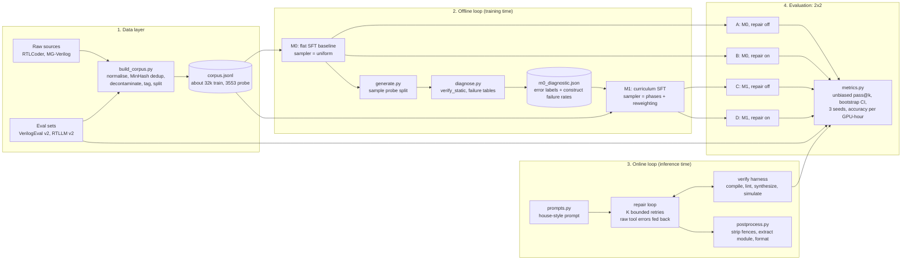
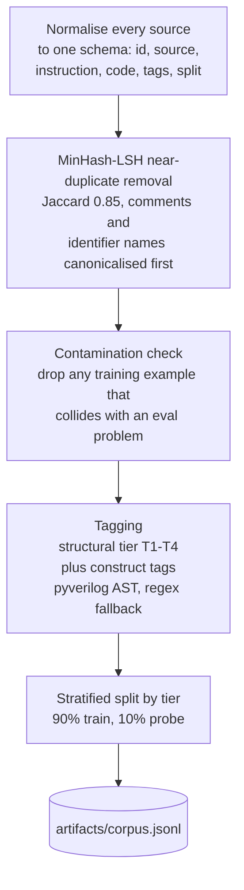
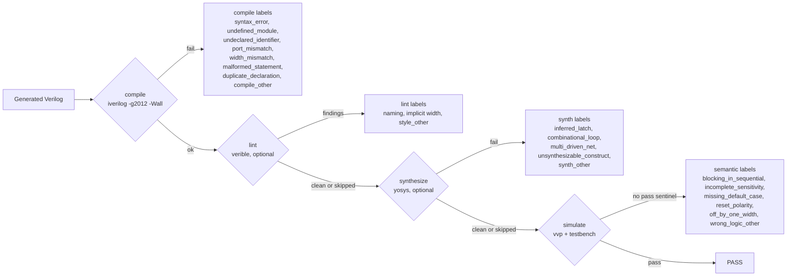
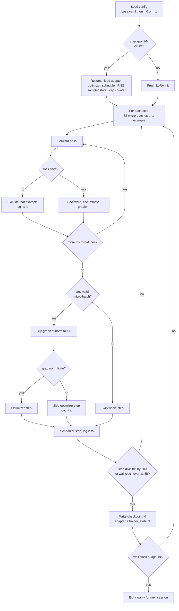
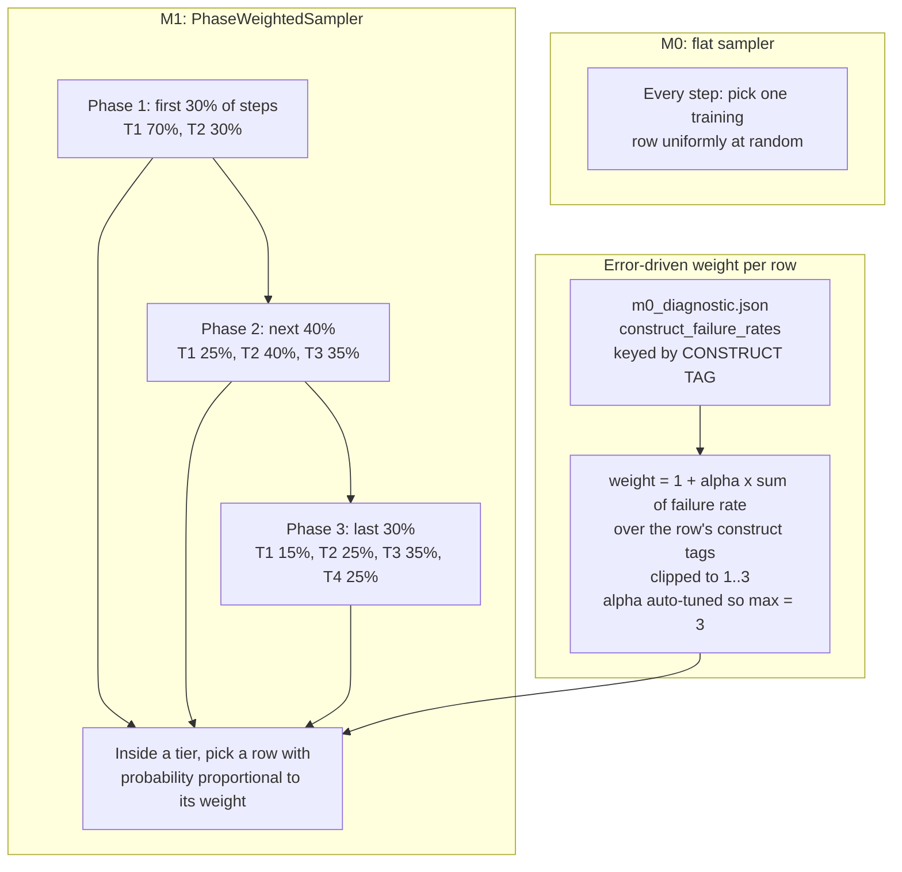
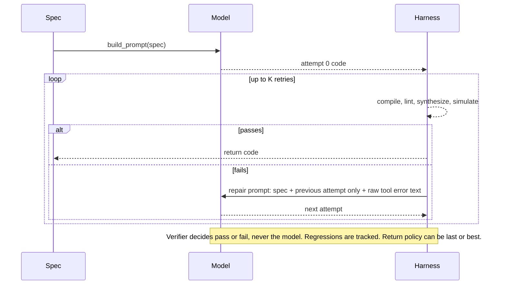
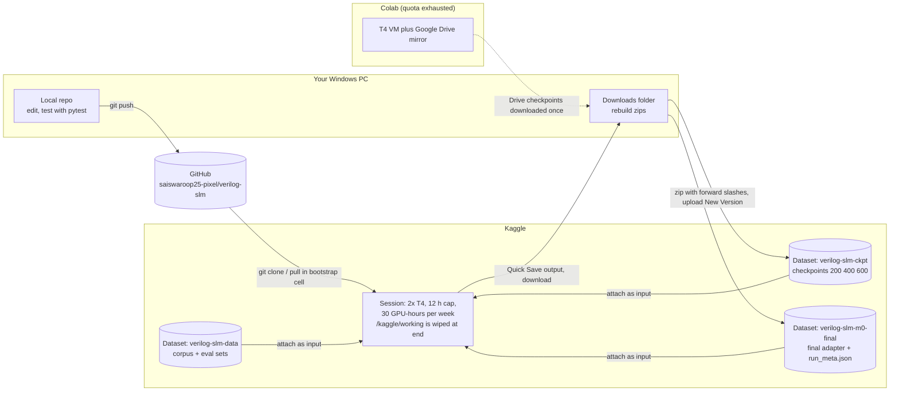
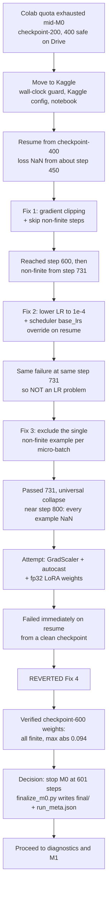
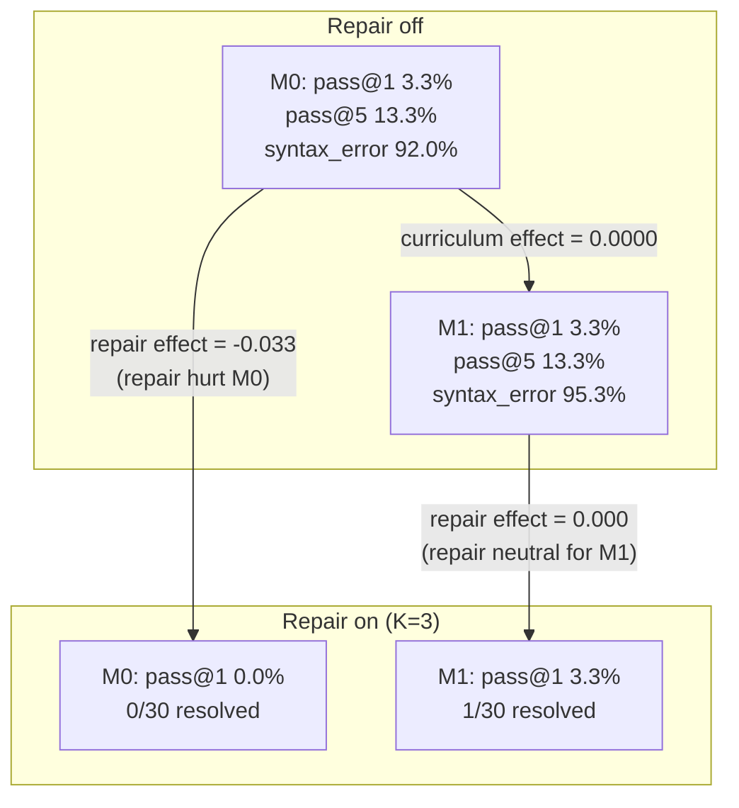

# Verilog SLM: the whole project, explained

This document explains everything in the project and everything we did in the
recent working sessions, in plain language. Diagrams are written in Mermaid,
so they render automatically on GitHub and in VS Code (Markdown Preview
Mermaid extension). Figure captions follow paper style so you can lift them
into your report.

Contents

1. The project in one page
2. Glossary (plain-language)
3. Architecture figures
4. Component walkthrough
5. What we did, in order (Kaggle move, the NaN saga, diagnostics, the bug fix)
6. Current state and numbers
7. Open issues and risks (read this before trusting M0/M1 results)
8. What to do next
9. Suggested limitations text for the dissertation
10. File map and commit log

---

## 1. The project in one page

**Goal.** Make a small language model (1.5 billion parameters) write good
Verilog (hardware description code), where "good" means it compiles, can be
synthesized into real hardware, follows house style, and passes a testbench.

**Core idea.** Two feedback loops, both closed by real tools (a compiler,
linter, synthesizer, simulator) instead of the model grading itself:

- **Offline loop (training time).** Train a baseline model **M0** with plain
  fine-tuning. Measure *what it gets wrong*. Use those failures to build a
  smarter training schedule (a *curriculum*) and train **M1** with the same
  budget. If M1 beats M0, the curriculum helped.
- **Online loop (inference time).** When the model writes broken code, feed
  the compiler's error message back to it and let it retry a bounded number
  of times (*repair loop*).

**The experiment.** A 2x2 table: {M0, M1} x {repair off, repair on}. This
separates the effect of the curriculum from the effect of repair.

**Rule that keeps the experiment honest.** M0 and M1 must differ in
*exactly one thing*: how training examples are sampled. Same base model,
same learning rate, same number of steps, same seed.

**Where we are.** Both M0 and M1 are trained (601 of a planned 2997 steps
each, by deliberate budget choice, not instability -- see Section 5) and the
first real 2x2 evaluation has run. The headline result: at this training
budget, M0 and M1 perform identically (pass@1 = pass@5, exactly, curriculum
effect = 0.0000), and the repair loop was neutral-to-harmful for both. This
is a genuine, defensible null result, not a broken pipeline -- Section 6 has
the full numbers and Section 9 has suggested write-up language. Getting here
took: moving from Colab to Kaggle, a long fp16-instability debugging saga,
a silent curriculum-reweighting bug, a silent inference-quantization bug
that invalidated every generation before it was found, and losing (then
redoing) one full M0 training run to a failed save. All of it is in
Section 5, in order, with the reasoning at each step.

---

## 2. Glossary

| Term | Plain meaning |
|---|---|
| **SFT** | Supervised fine-tuning: show the model (instruction, correct code) pairs and nudge it to reproduce them. |
| **LoRA** | Instead of changing all 1.5B weights, train small add-on matrices (adapters). Cheap and small to save (about 141 MB). |
| **QLoRA** | LoRA on top of a base model stored in 4-bit numbers to save memory. |
| **fp16 / bf16** | 16-bit number formats. fp16 has a narrow range and overflows easily. The T4 GPU can only do fp16 well, not bf16. |
| **NaN** | "Not a number". Once a NaN enters a calculation it spreads to everything after it. |
| **Gradient clipping** | Cap how big a single update can be so one bad batch cannot wreck the weights. |
| **Checkpoint** | A saved snapshot (adapter weights + optimizer state + step counter) so training can resume. |
| **Curriculum** | Ordering/weighting training examples on purpose (easy first, oversample what the model fails at). |
| **Tier (T1..T4)** | Structural difficulty of a design: T1 combinational, T2 sequential, T3 finite-state machine, T4 multi-module. |
| **Construct tag** | Which Verilog features a design uses, e.g. `case_stmt`, `async_reset`, `generate_block`. |
| **Error label** | Why a generated design failed, e.g. `syntax_error`, `inferred_latch`. Not the same thing as a construct tag. |
| **Probe split** | A 10% slice of the corpus held out from training, used to *diagnose* M0 (never trained on). |
| **pass@k** | Probability that at least one of k samples is correct. The unbiased estimator is used. |
| **Ablation** | Change one thing, keep everything else fixed, measure the difference. |
| **Kaggle Dataset** | Persistent storage on Kaggle. The session disk is wiped when a session ends; a Dataset is not. |

---

## 3. Architecture figures

### Figure 1. End-to-end system architecture

*Fig. 1. Four layers. The data layer builds one tagged corpus. The offline loop trains M0, measures its failures on a held-out probe split, and feeds that table into M1's sampler. The online loop wraps any model in a verifier-gated repair loop. The evaluation layer crosses the two models with repair on/off.*

### Figure 2. Data pipeline

*Fig. 2. Corpus construction. Step 3 protects the benchmark from leakage; every drop is counted and reportable.*

### Figure 3. Four-stage verification harness and error taxonomy

*Fig. 3. Every failure anywhere in the project is reduced to exactly one label from a frozen enum (`src/verify/taxonomy.py`). The diagnostic pass on the probe split has no testbenches, so it uses `verify_static()` (first three stages only).*

### Figure 4. Training loop internals (`src/train/sft.py`)

*Fig. 4. Effective batch = 1 example x 32 accumulation = 32. Gradients from the 32 micro-batches are summed before one optimizer step. The three guards (non-finite loss exclusion, gradient clipping, non-finite grad-norm skip) and the wall-clock exit were all added during the NaN saga (Section 5).*

### Figure 5. Curriculum sampler (M1) versus flat sampler (M0)

*Fig. 5. M0 and M1 run for the same number of steps; only which examples fill the steps differs. The fix in Section 5.6 corrected the key used in the "Error-driven weight" box (construct tag, not error label).*

### Figure 6. Online repair loop

*Fig. 6. Design points: raw error text (not summarised), only the previous attempt in context, K is a hard bound, regressions logged.*

### Figure 7. Compute and persistence architecture (how work moved from Colab to Kaggle)

*Fig. 7. Code travels through GitHub; data and checkpoints travel through Kaggle Datasets. Nothing on the session disk survives the session, so every artifact worth keeping must round-trip through a Dataset.*

### Figure 8. The instability debugging timeline (decision tree)

*Fig. 8. Each "Fix" addressed a real defect found by evidence, but none removed the underlying fp16 instability. Fix 4 made things worse and was reverted on evidence. The run was finalized at the last verified-clean checkpoint.*

**Epilogue to this figure:** the 601-step finalized run above was later judged
unusable on different grounds -- its loss had climbed to 3.5+ well before any
NaN and finished at 4.6, a genuine training-quality failure, separate from
the instability fight itself (Section 5.9). M0 was retrained from scratch at
`lr=1e-4` from step 0 (not a resume), deliberately capped at 601 steps to
match the budget already spent on M1, and that retrain reproduced a healthy
loss curve (0.43 to 0.80) with zero non-finite events across all 601 steps.
It was then lost when a Kaggle session ended before the weights were
downloaded (Quick Save had silently captured nothing), and had to be
retrained a second time under a separate Kaggle account for a fresh quota --
that second retrain reproduced the *same* loss curve almost exactly (fixed
seed, deterministic pipeline), which is itself a small reassuring
confirmation that the result is real and repeatable, not a fluke.

### Figure 9. Roadmap and status

*Fig. 9. Status at the time of writing.*

### Figure 10. Eval result summary (30 problems, n=5, seed 1337)

*Fig. 10. `pass@5` for the repair-on cells is a mathematical artifact (only 1 sample per problem there, and the unbiased estimator returns exactly 1.0 whenever fewer samples exist than k) -- not a real number, omitted here. The honest read: no detectable curriculum effect, and the repair loop did not help either model at this competence level.*

---

## 4. Component walkthrough

### 4.1 Data (`src/data/`)
`build_corpus.py` merges the two training sources into one schema, removes
near-duplicates with MinHash, and removes anything that collides with the two
benchmark sets, so the model is never trained on the test questions.
`tagger.py` labels every example with a tier and construct tags (using an AST
parser when it can, regexes otherwise). `splits.py` holds out 10% as the
probe split, stratified by tier. Results are stored in
`artifacts/corpus.jsonl` (not in git; it is built once and stored in a Kaggle
Dataset).

### 4.2 Prompts (`src/utils/prompts.py`)
One file holds the system prompt (the "house style contract": nonblocking
assignments in clocked blocks, explicit `default` in `case`, no latches, and
so on), the generation template, and the repair template. Training text and
inference prompts are built from the same template so they cannot drift apart.

### 4.3 Verification (`src/verify/`)
`harness.py` runs the four stages of Figure 3 and returns one
`VerifyResult`. `classify.py` turns raw tool text into one label from the
frozen enum in `taxonomy.py`. The lint and synthesis stages are this
project's addition to the base guide, because a passing testbench does not
prove the design is synthesizable or reviewable (see
`docs/industry_standards.md`).

### 4.4 Training (`src/train/`)
`sft.py` is the single training entry point. It loads the base model in 4-bit,
attaches LoRA adapters, and runs the loop in Figure 4. Config files layer:
`base.yaml` holds the shared settings, `m0_*.yaml` and `m1_*.yaml` add only
what differs. `curriculum.py` holds the phase-based sampler and the
reweighting function (Figure 5).

Key settings: Qwen2.5-Coder-1.5B-Instruct, 4-bit NF4, LoRA r=32 alpha=64
dropout 0.05 on all attention and MLP projections, sequence length 2048,
batch 1 x 32 accumulation, cosine schedule with 3% warmup, seed 1337.

### 4.5 Inference and repair (`src/infer/`)
`generate.py` does batched sampling from a trained adapter. `repair.py` is the
bounded loop of Figure 6. `postprocess.py` strips markdown fences, keeps only
the module, and formats with verible. Inference loads the base model with the
**same 4-bit NF4 quantization config training used** (`configs/base.yaml`'s
`quantization` block) -- this was not always true (Section 5.10) and getting
it wrong doesn't just cost some quality, it produces fully degenerate output.

### 4.6 Evaluation (`src/eval/`)
`diagnose.py` builds the failure tables from probe-split generations.
`metrics.py` holds pass@k (unbiased), bootstrap confidence intervals, error
rate tables, and accuracy per GPU-hour. `run_eval.py` runs the 2x2.

### 4.7 Tests (`tests/`)
51 pure-Python tests pass (3 skipped). None of them need a GPU or iverilog.
Note: `sft.py` itself has no unit tests because it needs the GPU stack.

---

## 5. What we did, in order

### 5.1 Starting state
The repo was clean on `master`. M0 was mid-run on Colab: memory checks had
passed (batch 1, sequence 2048), a batch-2 test was slower, resumable
checkpoints mirrored to Google Drive existed, and stdout buffering through
`tee` had been fixed.

### 5.2 Moving from Colab to Kaggle
**Problem.** Colab's GPU quota ran out. Kaggle offers about 30 GPU-hours per
week with a hard 12-hour cap per session (verified by web search, not
assumed).

**Design.** `sft.py`'s resume logic already keyed off local `checkpoint-N/`
folders, so it was platform-independent. Kaggle *kills* a session at the cap
(Colab only disconnects), which could truncate a checkpoint mid-write. So we:

- added `training.max_wall_hours`: check every step; save a clean checkpoint
  and exit before the platform kills the process;
- added `configs/m0_baseline_kaggle.yaml` (same `run_name: m0`, so it resumes
  the same run; adds `max_wall_hours: 11.5`);
- built `notebooks/02_train_kaggle.ipynb` with a Kaggle-native bootstrap.

**Things that went wrong along the way, and why**

| Symptom | Cause | Fix |
|---|---|---|
| `Could not resolve host: github.com` | Kaggle Internet toggle was off | Turn Internet on, restart session |
| `configs/m0_baseline_kaggle.yaml` not found | New files existed only locally, never pushed | Commit and push (rebased over Colab's auto-commit) |
| Restored corpus/checkpoint not found | Kaggle mounts Datasets at different paths in different sessions (`/kaggle/input/<slug>/` vs `/kaggle/input/datasets/<user>/<slug>/`) | Bootstrap searches all of `/kaggle/input` recursively by filename |
| `adapter_config.json` missing inside restored checkpoint | Uploaded zip landed double-nested (`checkpoint-400/checkpoint-400/...`) | Match by `adapter_config.json` presence; manual `cp` from the real path when needed |
| Silent skip of restore | "skip if destination exists" printed nothing | Print an explicit `skipped` message |
| Kaggle rejected our zip: `forbidden character '\'` | PowerShell 5.1 `Compress-Archive` writes backslash paths | Build zips with .NET `ZipArchive` and forward slashes |
| `trainer_state.pt` arrived as `trainer_state.zip` | `.pt` files are already ZIP containers; Kaggle relabelled it | Rename back; verified by loading with `torch.load` |
| Files "vanished" from a Downloads folder | Unclear (Defender history showed nothing relevant) | Re-download and re-verify |
| `ConcurrencyViolation` on Save Version | Notebook draft advanced by another tab | Close extra tabs, refresh, or download manually |

**Throughput check.** On 2x T4 with `device_map="auto"` the model is split
across both GPUs (pipeline style, not data-parallel). Measured: batch 1 about
42.3 s/step, batch 2 about 57.6 s/step. So the split does not help; we kept
batch 1. Full 601 steps is about 7 GPU-hours.

### 5.3 The NaN saga (why M0 stopped at 601 steps)

The loss became NaN from about step 450. NaN in the forward pass poisons
every later computation, so a run that hits it never recovers by itself.

1. **Fix 1: gradient clipping and skipping non-finite steps.** Cap the update
   size; if the gradient norm is already NaN or infinite, skip the update.
   Result: run reached step 600, then failed again around step 731.
2. **Fix 2: lower the learning rate to 1e-4.** This needed a code change:
   when a checkpoint is loaded the scheduler restores its old base learning
   rate and silently overwrites the new config value. We now force the
   scheduler's base LR from the current config after loading. Result: same
   failure at the same step 731. Same step under a different LR means the cause
   was **not** the learning rate.
3. **Fix 3: per-example exclusion.** Reasoning: each optimizer step sums
   gradients from 32 examples; the sampler's random state is restored on
   resume, so the same 32 examples appear at step 731 every time. One example
   with a NaN loss poisons the whole sum. We now check each example's loss and
   exclude only that example. Result: training passed 731 and reached about
   800, then **every** example gave NaN (a universal collapse).
4. **Fix 4 (reverted): GradScaler + autocast + fp32 LoRA weights.** The
   standard mixed-precision recipe. On resuming from a checkpoint whose
   weights we had verified finite and small (max absolute value 0.094), it
   failed immediately on the first step, worse than before. Likely an
   interaction with the 4-bit base layers that we could not verify without a
   GPU to test on. Reverted on the evidence.
5. **Verification we ran.** Loaded `checkpoint-800` and `checkpoint-600`
   adapters and optimizer state and checked for NaN/inf: both clean. So the
   files were fine; the numerical fragility appears when running the
   forward pass. Also found the logged moving-average loss was permanently
   NaN after one bad step (0.98 x NaN stays NaN forever); a cosmetic bug we
   fixed by resetting it on resume.
6. **Decision.** Stop M0 rather than keep spending GPU-hours. We wrote
   `scripts/finalize_m0.py`, which builds `artifacts/m0/final/` and
   `run_meta.json` in the same format `sft.py` writes on natural completion,
   with `total_steps: 601` and a `stopped_early_reason`. Everything
   downstream (M1's assertion, diagnostics, eval) then treats it as M0's
   finished run.

Honest status: the root cause of the fp16 instability was **not** found. The
guards contain it but do not remove it.

### 5.4 Persisting M0
We downloaded `final/` and `run_meta.json`, zipped them with correct paths,
and uploaded the Kaggle Dataset `verilog-slm-m0-final`.

### 5.5 Inference and diagnostic-pass fixes
Running the diagnostic pass exposed several separate problems:

| Problem | Cause | Fix |
|---|---|---|
| `tokenizer.json` JSON parse error at a fixed byte offset in every copy | The saved copy was corrupt at creation (size matched, content did not) | Load the tokenizer from the base model; LoRA never changes it |
| `incompatible torchao` ImportError | Kaggle's torchao is older than what peft requires | `pip install -U torchao` |
| "right-padding detected" warning | Batched generation on a decoder-only model needs left padding, otherwise shorter prompts start generating from inside their own padding | `tokenizer.padding_side = "left"` |
| Estimated hours of generation | 3553 probe problems x 5 samples x up to 768 tokens | `--limit` (random subsample) and `--max-new-tokens` flags |
| Silence for an hour | No progress output | Per-batch progress and ETA |
| Suspected 2-GPU split overhead in generation | Every new token crosses the GPU boundary | Pin inference to one GPU |
| `iverilog not found` | Toolchain cell not run in a fresh session | Run the apt-get cell |

The final generation run: 100 problems x 5 samples = 500 generations,
63 batches, 47.3 minutes, `max_new_tokens=256`.

### 5.6 The reweighting bug we found and fixed
After diagnosis returned "100% syntax_error", we asked how the table feeds M1.

- `diagnose.py` produced a table keyed by **error label** (`syntax_error`,
  `compile_other`, ...).
- `compute_reweighting()` looks up each training row's **construct tags**
  (`case_stmt`, `async_reset`, ...) in that table.
- The two name sets never overlap, so every lookup returned 0. Every row got
  weight 1.0. M1's error-driven reweighting was silently a no-op; only the
  tier-phasing half of the curriculum would have differed from M0.
- An existing unit test had missed it because it used the same string as both
  a construct tag and an error label.

Fix: `metrics.construct_failure_rate_table()` computes the fraction of
generations failing for each construct tag; `diagnose.py` now carries each
generation's construct tags and writes `construct_failure_rates`; `sft.py`
reads that field. A regression test was added (51 tests pass).

### 5.7 Matching M1 to what M0 actually was
`base.yaml` says lr 2e-4, but M0's finished run used 1e-4. Left alone, M1
would have differed from M0 in two ways (sampler and learning rate), breaking
the one-variable rule. `configs/m1_curriculum_kaggle.yaml` now sets
`lr: 1.0e-4`.

### 5.8 M1 trained cleanly; M0's first retrain was lost
M1 trained the full 601 steps at `lr=1e-4` with **zero** non-finite events --
a clean run, unlike everything M0 had been through. Verified: adapter
weights all finite (max |w| 0.056), `checkpoint_hash` matches M0's exactly,
`diagnostic_table_path` confirms it used the (already-fixed) construct-keyed
reweighting table.

Given M1's clean run, the original 601-step M0 (finalized early due to
instability, Section 5.3) was judged not good enough to compare against
fairly -- so M0 was **retrained from scratch**, fresh LoRA init (not a
resume of the broken run), same `lr=1e-4`, deliberately capped at 601 steps
via a new `training.max_steps` to match M1's already-spent budget rather
than commit to the full 2997-step, ~35 GPU-hour run. `configs/
m0_retrain_kaggle.yaml` encodes this, with an explicit warning not to attach
the old checkpoint dataset (attaching it would silently resume the broken
run instead of starting fresh).

That first retrain finished cleanly (loss 1.47 to 0.43 to 0.80, zero
non-finite events, 6.83 GPU-hours) -- and was then **lost**. The Kaggle
session ended before the model weights were downloaded; three separate
Quick Saves of that notebook all came up with an empty Output (a real
Kaggle quirk, not a mistake in the steps taken). Only three small files
survived, downloaded directly from the live session's file browser just
before it died: `run_meta.json`, `m0_diagnostic.json`, `train_log.jsonl`.
The actual weights (`adapter_model.safetensors`) were gone.

### 5.9 The generation-quantization bug
Before retraining M0 a second time, the corrected diagnostic pass on the
(soon to be lost) first retrain still showed persistently high failure
rates -- every construct tag at 100% failure, 81.4% of failures still
`syntax_error` -- which didn't fit a training run with a healthy loss curve.
A direct side-by-side generation test (base model alone, vs. M1's adapter
attached, vs. M1's adapter *merged* into the weights) isolated it:

- The raw base model, no adapter, generated correct, coherent text --
  twice, independently. The shared generation code was not the bug.
- M1's adapter attached to the full-precision (`bfloat16`, unquantized)
  base -- both as a live PEFT wrapper *and* fully merged into the weights --
  produced degenerate output: a single repeated character for the entire
  200-token generation. Merging rules out a PEFT/caching bug (a merged
  model is just a plain model with the adapter's numbers baked in).
- Loading the base model **quantized the same way training did** (4-bit
  NF4, float16 compute -- `configs/base.yaml`'s own `quantization` block)
  and attaching the same adapter produced real, structured Verilog
  immediately: `module bin2dec(...); always @ * begin ... end endmodule`.

Root cause: a LoRA delta learned during training implicitly compensates for
the specific numerical error 4-bit NF4 quantization introduces into the base
weights it was trained against. `generate.py` had been loading the base
model at full precision "for cleaner inference quality" -- which is exactly
backwards for a QLoRA adapter. Every prior generation run in this project
(the very first M0 diagnostic pass, and everything downstream of it) was
against this broken path. Fixed in `src/infer/generate.py`'s
`load_model_for_inference()`: read `configs/base.yaml`'s quantization
settings directly, the same source of truth `sft.py` trains against.

Testing the same fix against the (about-to-be-lost) M0 retrain's adapter
showed it did **not** recover the same way M1 did -- confirming M0's
problem was in training itself, not just how it was being read afterward,
which is exactly what its loss curve (climbing to 3.5+ before ever going
NaN in the very first Colab attempt) had already suggested.

### 5.10 M0's second retrain, done carefully
Retrained a second time, under a separate Kaggle account (for a fresh
weekly quota, since the first account's was largely spent). Same config,
same fixed seed -- reproduced the *same* loss curve as the lost first
retrain almost exactly (1.4678 to 0.4282 to ... to 0.7974), which is a
useful confirmation that this is a real, repeatable result and not a
fluke. This time, `artifacts/m0/final/` was downloaded directly from the
live session **immediately** on completion, before Quick Save, before
anything else -- verified finite (max |w| 0.055) and uploaded as its own
dataset before the session could be closed.

### 5.11 Sizing and fixing `run_eval.py` for Kaggle
The original 2x2 spec (n=20 samples, k_repair=3, 3 seeds, the full combined
eval sets -- 206 problems) would take many hours to days at this project's
measured throughput, and the repair-on path had **zero** progress output
(unbatched -- one problem at a time, up to `k_repair+1` sequential
`generate()` calls each -- indistinguishable from a hang for anything but a
handful of problems). Added `--limit` (random subsample, fixed sampling
seed independent of the eval seeds so every seed evaluates the same
problems), `--max-new-tokens`, and per-problem progress+ETA to the
repair-on path. Sized the Kaggle run at 30 problems, n=5, 1 seed
(~1.5-2 hours) rather than the full multi-day spec.

Running it immediately hit a second real, pre-existing bug: `KeyError:
'tier'`. The eval-set schema (`scripts/build_eval_jsonl.py`) nests
structural tier under `row["tags"]["tier"]` -- the same nesting the corpus
schema uses, and the same nesting `diagnose.py` already reads correctly --
but `run_eval.py` read `row["tier"]` directly in two places. This is the
first real end-to-end eval run in the project's history, so it had never
been exercised before. Fixed both call sites, added
`tests/test_run_eval.py` (fakes generation and verification the same way
`test_repair.py` already does, so this class of bug is now caught locally
instead of only surfacing after real GPU-hours are spent on a run that
can't finish).

### 5.12 The actual eval result
30 problems, n=5, seed 1337, both models, repair off and on:

| Cell | pass@1 | pass@5 | syntax_error rate |
|---|---|---|---|
| M0, repair off | 3.3% | 13.3% | 92.0% |
| M1, repair off | 3.3% | 13.3% | 95.3% |
| M0, repair on (K=3) | 0.0% | n/a (see below) | 100% |
| M1, repair on (K=3) | 3.3% | n/a (see below) | 90.0% |

`curriculum_effect (M1 - M0, repair off) = 0.0000` -- exactly zero. At this
training budget the two models are statistically indistinguishable on
pass@1/pass@5. `repair_effect (M0) = -0.033` -- the repair loop made M0
strictly worse, resolving 0 of 30 problems in up to 3 attempts each (full
budget used every time, no success). `repair_effect (M1) = 0.000` -- neutral,
resolving 1 of 30. Neither model's repair loop showed evidence of learning
anything useful from the compiler's error text at this competence level.

The per-category delta table adds one nuance worth reporting cautiously
(small counts, single seed): M1 had a *lower* rate of the more "structural"
mistakes (`undefined_module` 11.0% to 4.1%, `wrong_logic_other` 4.1% to
1.4%, `port_mismatch` 2.1% to 0.7%) but a *higher* raw `syntax_error` rate
(74.5% to 82.8%) than M0. A plausible read is that M1 is attempting more
complete, structurally ambitious code and tripping on surface syntax more
often, while M0 fails at a more basic level -- but with 1-3 occurrences
behind most of these deltas, this shouldn't be leaned on hard without more
samples.

One methodological note worth keeping: **`pass@5` is not a meaningful
number for the repair-on cells** and is omitted from the table above. The
repair-on path generates exactly one sample per problem (one repair
trajectory, not five independent draws), and the unbiased pass@k estimator
mathematically returns exactly 1.0 whenever fewer samples exist than `k` --
this showed up as both repair-on cells reporting "pass@5 = 100%", which is
an estimator artifact, not a real result.

---

## 6. Current state and numbers

| Item | Value |
|---|---|
| Base model | Qwen2.5-Coder-1.5B-Instruct, 4-bit |
| Planned steps (original design) | 2997 (3 epochs, effective batch 32) |
| Actual steps, M0 and M1 | 601 each (deliberate budget cap, not instability) |
| Learning rate | 1e-4 for both (matched, one-variable ablation preserved) |
| Checkpoint hash | `49cef5cbe22469ba` -- identical for M0 and M1, confirms same base checkpoint |
| M0 final loss / M1 final loss | 0.80 / 0.93 (not directly comparable -- different samplers see different difficulty mixes) |
| Adapter weights | both verified finite; M0 max \|w\| 0.055, M1 max \|w\| 0.056 |
| Training time | M0 6.83 GPU-h (second retrain), M1 7.8 GPU-h |
| Eval sample | 30 problems (random subsample of 206), n=5, seed 1337 |
| **pass@1, repair off** | **M0 3.3%, M1 3.3% -- curriculum effect = 0.0000** |
| **pass@5, repair off** | **M0 13.3%, M1 13.3%** |
| syntax_error rate, repair off | M0 92.0%, M1 95.3% |
| **repair effect (pass@1)** | **M0 -3.3% (harmful), M1 0.0% (neutral)** |
| repair-on resolution | M0 0/30 resolved, M1 1/30 resolved |
| Tests | 53 pass, 3 skipped |

Interpretation: at 601 steps, both models are still near the floor and are
statistically indistinguishable from each other on the headline metric. This
is a real, reportable null result at this training budget -- not a failed
pipeline. Full breakdown, including the per-category nuance, in Section 5.12.

---

## 7. Open issues and risks

Read these before extending or citing these results further.

1. **Training text has no end-of-sequence token (verified), effect not
   separately isolated from the training-budget limitation.**
   `format_sft_example()` builds `prompt + "\n" + code` with no EOS token
   appended, and generation showed batch times that were nearly constant
   (consistent with runs hitting the token cap rather than stopping early).
   This may be contributing to the high `syntax_error` rates alongside the
   more fundamental 601-step undertraining -- the two haven't been
   disentangled. Fix options: (a) stop generation at the first `endmodule`
   (no retraining, helps evaluation immediately); (b) append
   `tokenizer.eos_token` to training text and retrain (correct long-term
   fix, costs a new M0 and M1). Also: loss is computed over prompt tokens
   as well as code (no prompt masking) -- a smaller issue, worth a line in
   the write-up regardless.
2. **Unresolved fp16 instability on T4.** Never occurred in either final
   retrain (both at `lr=1e-4`, both clean), but the root cause from the
   original NaN saga (Section 5.3) was never found, only contained by the
   guards. Longer training runs on this hardware should expect to hit it
   again and use the same playbook.
3. **Small sample, single seed.** 30 problems, one seed, is not enough
   statistical power to rule out a small real effect -- it can only detect
   a large one, and didn't. Don't claim "the curriculum doesn't work"; claim
   "no effect was detected at this sample size and training budget."
4. **Both models are still undertrained relative to the original design.**
   601 of 2997 planned steps (~20%). More training, not more eval samples,
   is the highest-value next spend if further GPU-hour budget becomes
   available -- see Section 8.
5. **Broad construct regexes.** Tags like `blocking_assign` and `arithmetic`
   match a large share of all code, so they carry limited discriminating
   information even with a well-trained model (Section 5.6's fix corrected
   *which* table gets used, not the underlying tag granularity).
6. **Bootstrap gaps.** Kaggle notebooks' bootstrap cells don't restore
   `run_meta.json` or `m0_diagnostic.json` automatically; restore them by
   hand from the attached Dataset (`find /kaggle/input -iname ...` first,
   then `cp` -- never assume a path, Kaggle's mount convention varies
   session to session).
7. **`docs/industry_standards.md`'s lint/synthesize stages were soft-gated
   throughout the actual eval run** (`require_lint_clean=False` by default
   in `verify()`) -- the reported numbers reflect compile+simulate
   correctness, not full industry-standard-RTL cleanliness. Worth being
   explicit about this scope in the write-up.

---

## 8. What to do next

The pipeline is now correct end to end and has produced one real result. From
here it's a question of how much further GPU-hour budget is available:

1. **If budget allows: more training steps, not more eval.** Both models are
   at ~20% of the original plan. Re-running eval on two already-near-floor
   models mostly narrows confidence intervals around zero; it won't reveal a
   real difference that more training hasn't produced yet. Resuming M0 and
   M1 further (same configs, same `lr=1e-4`, matched step counts) is the
   highest-value next spend.
2. **If concluding now:** write up the null result honestly (Section 9),
   including the per-category nuance and the `pass@5`-for-repair-on caveat.
   A defensible null result, clearly explained, is a legitimate dissertation
   finding.
3. Either way: do the cheap EOS-token check (Section 7, item 1) before
   trusting any future syntax-error-rate comparison -- it's a real unknown
   that could be inflating the numbers for both models equally, which
   wouldn't change the *comparison* but would change the *absolute* rates
   reported.
4. If more eval is wanted regardless: increase `SEEDS` in
   `notebooks/07_eval_kaggle.ipynb` first (gives the cross-seed std the
   analysis cells are built to show) before increasing `LIMIT` -- knowing
   whether an effect is inside noise matters more than a larger single-seed
   sample.

---

## 9. Suggested limitations text for the dissertation

> M0 and M1 were each trained for 601 of the 2997 originally planned
> optimizer steps, a deliberate budget decision made after extensive fp16
> numerical instability on Tesla T4 GPUs (no native bf16 support) required
> multiple recovery iterations -- gradient clipping, per-example non-finite
> exclusion, and a lowered learning rate (1e-4, applied to both models to
> preserve a one-variable ablation) contained the instability without fully
> eliminating its root cause. A separate bug was found and fixed in the
> inference path: the base model was being loaded at full precision rather
> than matching the 4-bit quantization used during training, which produced
> completely degenerate generations regardless of the underlying adapter
> quality; all reported results are from the corrected pipeline. Evaluation
> (VerilogEval/RTLLM, n=5 samples per problem, 30-problem random subsample,
> single seed) found no detectable difference between the flat-sampled
> baseline (M0) and the curriculum-trained model (M1) on pass@1 or pass@5
> (both 3.3% and 13.3% respectively), and found the compiler-feedback repair
> loop to be neutral-to-harmful for both models at this competence level
> (M0: 0 of 30 problems resolved in up to 3 repair attempts; M1: 1 of 30).
> Given the small sample size and single seed, this should be read as "no
> effect was detected at this training budget," not as evidence the
> curriculum or repair mechanisms do not work; both models remain
> substantially undertrained relative to the original 2997-step design, and
> a meaningful test of either hypothesis would require completing that
> training budget before re-evaluating.

---

## 10. File map and commit log

### Files added or changed in this work

| File | Purpose |
|---|---|
| `src/train/sft.py` | wall-clock stop, gradient clipping, non-finite guards, per-example exclusion, LR override on resume, NaN-EMA reset, construct-keyed reweighting input |
| `src/infer/generate.py` | tokenizer from base model, left padding, single GPU, **quantized model loading matching training** (the big one -- Section 5.9), `--limit`, `--max-new-tokens`, progress/ETA |
| `src/eval/run_eval.py` | `--limit`, `--max-new-tokens`, per-problem progress+ETA on the repair path, **fixed `row["tier"]` to `row["tags"]["tier"]`** (Section 5.11) |
| `src/eval/metrics.py` | `construct_failure_rate_table()` |
| `src/eval/diagnose.py` | carries construct tags, writes `construct_failure_rates` |
| `tests/test_metrics.py`, `tests/test_run_eval.py` | regression tests for the construct table and the eval-set tier schema |
| `scripts/finalize_m0.py` | finalize any run early at a chosen checkpoint |
| `scripts/ask.py` | single-question CLI: one spec in, one generated module out |
| `configs/m0_baseline_kaggle.yaml`, `..._recovery.yaml` | M0 on Kaggle, then with lr 1e-4 |
| `configs/m0_retrain_kaggle.yaml` | clean-slate M0 retrain, lr 1e-4 from step 0, capped at 601 steps |
| `configs/m1_curriculum_kaggle.yaml` | M1 on Kaggle (`max_wall_hours`, lr 1e-4) |
| `notebooks/02_train_kaggle.ipynb` | Kaggle bootstrap, M0 (now the retrain config), diagnostic pass, M1 |
| `notebooks/05_generation_check_kaggle.ipynb` | the M0-vs-M1-vs-base generation A/B test that found the quantization bug |
| `notebooks/06_ask_kaggle.ipynb` | live Q&A web page (Gradio) for a trained adapter |
| `notebooks/07_eval_kaggle.ipynb` | Kaggle port of the 2x2 eval, sized for a single session |

### Commit log (newest last)

| Commit | Summary |
|---|---|
| b314490 | Kaggle migration path: wall-clock stop, config, notebook |
| 68963a4, 4685d5d | Kaggle restore: match by `adapter_config.json`; print skips |
| 2f9900b | gradient clipping and non-finite guard |
| 8d960f9 | LR override on resume, recovery config |
| 080728f | exclude non-finite-loss examples individually |
| b58a1d4 | GradScaler + fp32 LoRA (later reverted) |
| 8e08357 | reset NaN-poisoned EMA on resume |
| 9d2325c | revert GradScaler/fp32 |
| e1f8deb | `finalize_m0.py` |
| a5e11d7 | M1 section in Kaggle notebook, M1 Kaggle config |
| 830eeb2 | tokenizer from base model |
| f715dba | left padding |
| 5bfb19a, ac9a705 | `--limit`, `--max-new-tokens` |
| 7318170 | progress logging |
| 6cc428b | single-GPU inference |
| 35bca91 | fix silent no-op reweighting |
| 6b5d54c | M1 lr matched to M0 |
| 9a9deef | `scripts/ask.py`, Kaggle Q&A page, this document (first version) |
| b189f7d | M0 retrain capped at 601 steps |
| ed2878a | **quantized model loading in `generate.py`** -- the big fix |
| 9ca7efb | eval sized for Kaggle: `--limit`, `--max-new-tokens`, progress logging |
| 1d281e1 | fixed `row["tier"]` KeyError -- eval-set tier is nested under `tags` |

### Lessons worth remembering

- Verify a claim instead of assuming it (a "clean" checkpoint, a file's
  contents, which folder a path lands in).
- A failure that reproduces at the same step under a different setting is not
  caused by that setting.
- A silent no-op is worse than a crash: the reweighting bug, the tokenizer
  dtype-vs-quantization bug, and the skipped restore all looked like success
  or produced *output* that had to be inspected by hand to reveal it was
  wrong -- none of them raised an exception.
- Make long jobs report progress and save state; assume any session can
  vanish -- one full training run was lost this way and had to be redone.
- When a fix makes things worse, revert it on evidence and say so.
- When two runs disagree, hold everything else constant and change one
  thing at a time (the base-model-alone / adapter-attached / adapter-merged
  A/B test is what actually found the quantization bug -- guessing first
  would have wasted more GPU-hours than the test cost).
